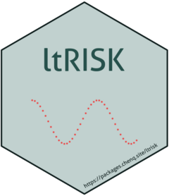

<!-- README.md is generated from README.Rmd. Please edit that file -->

```{r, include = FALSE}
knitr::opts_chunk$set(
  collapse = TRUE,
  comment = "#>",
  fig.path = "man/figures/README-",
  out.width = "100%"
)
```

# ltRISK 

<!-- badges: start -->
[](https://github.com/gigu003/ltRISK/actions/workflows/R-CMD-check.yaml)
[](https://github.com/gigu003/ltRISK/actions/workflows/test-coverage.yaml)
[](https://app.codecov.io/gh/gigu003/ltRISK)
<!-- badges: end -->

## Overview

**ltRISK** estimates lifetime and age-conditional risks of developing or dying from cancer using population-based cancer registry data. It provides a reproducible R interface for comparing several established approaches used in cancer surveillance:

- **DevCan method** for current-probability estimates based on first primary cancers.
- **Wun method** for historical comparisons with earlier DevCan-style estimates.
- **Adjusted for Multiple Primaries (AMP) method** for aggregated incidence data that may include multiple primary cancers.
- **Traditional cumulative risk** over a fixed age range.

The main wrapper, `calc_ltr()`, returns risk estimates and confidence intervals. Both gamma-based and delta-method confidence intervals are supported through the `ci_method` argument. The package also supports the piecewise mid-age group joinpoint (PMAJ) model used in recent DevCan implementations.

## Installation

You can install the development version of **ltRISK** from GitHub with:

``` r
# install.packages("devtools")
devtools::install_github("gigu003/ltRISK")
```

## Quick example: DevCan method

The package includes example data from DevCan-related publications and SEER data. The following example estimates the lifetime and age-conditional risks of developing breast cancer using the DevCan method.

```{r example-devcan-gamma}
library(ltRISK)

data("seer_example_data")

breast <- seer_example_data[seer_example_data$site == "Breast", ]
all_sites <- seer_example_data[
  seer_example_data$site == "All" & seer_example_data$sex == 0,
]

calc_ltr(
  ages = breast$ages,
  cancer = breast$cancer,
  cancer_death = breast$cancer_death,
  death = breast$death,
  pys = breast$pys,
  risk_func = "devcan",
  maj_method = "constant",
  ci_method = "gamma",
  age_start = c(0, 30, 50, 70),
  age_end = c(30, 50, 70, Inf),
  digits = 4
)
```

The same calculation can be written with the data-frame interface
`calc_ltr_df()`, which is convenient for pipe-based workflows:

```{r example-devcan-df}
calc_ltr_df(
  breast,
  ages = ages,
  cancer = cancer,
  cancer_death = cancer_death,
  death = death,
  pys = pys,
  risk_func = "devcan",
  maj_method = "constant",
  ci_method = "gamma",
  age_start = c(0, 30, 50, 70),
  age_end = c(30, 50, 70, Inf),
  digits = 4
)
```

For multiple registry strata, `calc_ltr_df()` can calculate risks by group:

```{r example-devcan-df-by}
calc_ltr_df(
  seer_example_data,
  by = c("site", "sex"),
  ages = ages,
  cancer = cancer,
  cancer_death = cancer_death,
  death = death,
  pys = pys,
  risk_func = "devcan",
  maj_method = "constant",
  ci_method = "delta",
  age_start = 0,
  age_end = Inf,
  digits = 4
)
```

## Age-range behavior

By default, `calc_ltr()` returns every valid combination of `age_start` and
`age_end`. Use `age_combine = "pairwise"` for positional, mutually exclusive
ranges such as 0--40, 40--50, and 50 years to the end of life.

```{r example-pairwise-ranges}
calc_ltr(
  ages = all_sites$ages,
  cancer = all_sites$cancer,
  cancer_death = all_sites$cancer_death,
  death = all_sites$death,
  pys = all_sites$pys,
  age_start = c(0, 40, 50),
  age_end = c(40, 50, Inf),
  age_combine = "pairwise",
  ci_method = "delta",
  digits = 4
)
```

## Faster large analyses

For point estimates only, use `ci_method = "none"`. DevCan, AMP, Wun, and
cumulative-risk models use analytic variances by default where available;
`variance_method = "finite_difference"` remains available for verification.
For many independent registry strata, `calc_ltr_df()` supports cross-platform
parallel processing.

```{r example-parallel, eval=FALSE}
risks <- calc_ltr_df(
  seer_example_data,
  by = c("site", "sex"),
  ci_method = "delta",
  variance_method = "analytic",
  parallel = TRUE,
  workers = 2,
  return_variance = TRUE
)
```

Repeated calculations use internal memoisation. Long-running pipelines can
inspect or clear these caches explicitly:

``` r
ltr_cache_info()
clear_ltr_cache()
```

For a large grouped job whose inputs are unlikely to repeat, use
`cache = "none"` in `calc_ltr_df()`. This discards memoised entries after each
group, including on reused PSOCK workers, and reduces peak cache growth.

Package developers can reproduce the confidence-interval timing comparison
from the source tree with:

``` sh
Rscript inst/benchmarks/benchmark-ci.R
```

The DevCan implementation is externally regression-tested against the female
breast cancer estimates and confidence intervals in Fay et al. (2003), Table
II. A seeded parametric coverage diagnostic can be run from the source tree:

``` sh
Rscript inst/validation/simulate-ci-coverage.R 1000
```

The variance model treats incidence, cancer-death, and other-death counts as
independent Poisson components and treats person-years as fixed. Comparisons of
overlapping populations or periods require covariance information that the
package does not estimate automatically.

## Formatting and comparisons

`format_risk_ci()` combines estimates and confidence limits for tables while
retaining the precision selected in `calc_ltr()`. With
`return_variance = TRUE`, grouped results can also be passed to `ztest()`,
`pairwise_ztest()`, or `trend_test()`.

```{r example-comparisons}
sex_risks <- calc_ltr_df(
  seer_example_data[
    seer_example_data$site == "All" &
      seer_example_data$sex %in% c(1, 2),
  ],
  by = "sex",
  ci_method = "delta",
  return_variance = TRUE,
  digits = 4
)

format_risk_ci(sex_risks)
ztest(sex_risks, group = "sex", ref = 2, compare = 1)
```

The same estimates can be calculated with delta-method confidence intervals:

```{r example-devcan-delta}
calc_ltr(
  ages = breast$ages,
  cancer = breast$cancer,
  cancer_death = breast$cancer_death,
  death = breast$death,
  pys = breast$pys,
  risk_func = "devcan",
  maj_method = "constant",
  ci_method = "delta",
  age_start = c(0, 30, 50, 70),
  age_end = c(30, 50, 70, Inf),
  digits = 4
)
```

To estimate the risk of dying from cancer instead of developing cancer, set `type = "dying"`.

```{r example-devcan-dying}
calc_ltr(
  ages = breast$ages,
  cancer = breast$cancer,
  cancer_death = breast$cancer_death,
  death = breast$death,
  pys = breast$pys,
  risk_func = "devcan",
  maj_method = "constant",
  ci_method = "gamma",
  type = "dying",
  age_start = c(0, 30, 50, 70),
  age_end = c(30, 50, 70, Inf),
  digits = 4
)
```

## Other supported methods

The same `calc_ltr()` interface can be used with the Wun and AMP methods by changing `risk_func`.

```{r example-other-methods}
# Wun method
calc_ltr(
  ages = all_sites$ages,
  cancer = all_sites$cancer,
  cancer_death = all_sites$cancer_death,
  death = all_sites$death,
  pys = all_sites$pys,
  risk_func = "wun",
  ci_method = "gamma",
  age_start = c(0, 50, 70),
  age_end = Inf,
  digits = 4
)

# AMP method
calc_ltr(
  ages = all_sites$ages,
  cancer = all_sites$cancer,
  cancer_death = all_sites$cancer_death,
  death = all_sites$death,
  pys = all_sites$pys,
  risk_func = "amp",
  ci_method = "gamma",
  age_start = c(0, 50, 70),
  age_end = Inf,
  digits = 4
)
```

## Traditional cumulative risk

Traditional cumulative risk can be calculated directly with `calc_ltr()` by setting `risk_func = "cumulative"`, or with the lower-level `cumulative()` and `get_risk()` workflow. Unlike DevCan, Wun, or AMP, this approach does not account for competing mortality.

```{r example-cumulative}
calc_ltr(
  ages = all_sites$ages,
  cancer = all_sites$cancer,
  cancer_death = all_sites$cancer_death,
  death = all_sites$death,
  pys = all_sites$pys,
  risk_func = "cumulative",
  type = "developing",
  maj_method = "constant",
  ci_method = "delta",
  age_start = 0,
  age_end = c(75, 85),
  digits = 4
)

cumu_developing <- cumulative(
  ages = all_sites$ages,
  cancer = all_sites$cancer,
  cancer_death = all_sites$cancer_death,
  death = all_sites$death,
  pys = all_sites$pys,
  type = "developing",
  maj_method = "constant"
)

get_risk(cumu_developing, age_start = 0, age_end = c(75, 85))
```

## Learn more

For a detailed introduction to the implemented methods, confidence interval calculations, and additional examples, see the package vignette:

``` r
vignette("use-ltRISK", package = "ltRISK")
```
