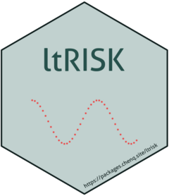

<!-- README.md is generated from README.Rmd. Please edit that file -->

# ltRISK 

<!-- badges: start -->

[](https://github.com/gigu003/ltRISK/actions/workflows/R-CMD-check.yaml)
<!-- badges: end -->

This is an R package used to estimate lifetime risk of developing or
dying from cancer using Population-Based Cancer Registry data.

## Installation

You can install the development version of ltRISK from
[GitHub](https://github.com/) with:

``` r
# install.packages("devtools")
devtools::install_github("gigu003/ltRISK")
```

## Example

This is a basic example which shows you how to solve a common problem:

``` r
library(ltRISK)
ni <- c(
  73872987, 82029530, 72267070, 78303514, 99425613, 119915673, 98068725,
  96644427, 121225951, 121250720, 96012917, 79863455, 75972753, 52929797,
  37551107, 29047207, 19584254, 13854299
)
mi <- c(
  60594, 17718, 18883, 28127, 37493, 75223, 83574, 100655, 211467, 278913,
  419663, 445223, 770865, 929008, 1058922, 1346942, 1576852, 2305312
)
di <- c(
  3511, 2801, 2553, 3183, 4960, 9456, 13509, 23935, 62386, 111640, 147866,
  203955, 301892, 304985, 302785, 323804, 275557, 197614
)
ri <- c(
  9303, 6887, 6248, 8509, 16961, 39439, 56670, 86535, 189251, 289320, 344395,
  411232, 552071, 491213, 433786, 395544, 292672, 173503
)
# Estimate the life time risk of developing cancer
ll <- ltr(mi, di, ri, ni, type = "developing")
estimate(ll)
#> $risk
#> [1] 26.85
#> 
#> $lower
#> [1] 26.7
#> 
#> $upper
#> [1] 27

# Estimate the life time risk of dying from cancer
dd <- ltr(mi, di, ri, ni, type = "dying")
estimate(dd)
#> $risk
#> [1] 19.8
#> 
#> $lower
#> [1] 19.73
#> 
#> $upper
#> [1] 19.87
```

Calculate the cumulative mortality risk with the predefined upper limit
age of 74 years.

``` r
cum <- cumrate(di, ni, eage = 70)
cumrisk(cum)
#> Cumulative Risk (1/100) 
#>                    16.1
```

You can also calculate the cumulative incidence risk with the predefined
upper limit age of 74 years.

``` r
cum <- cumrate(ri, ni, eage = 70)
cumrisk(cum)
#> Cumulative Risk (1/100) 
#>                   24.67
```
